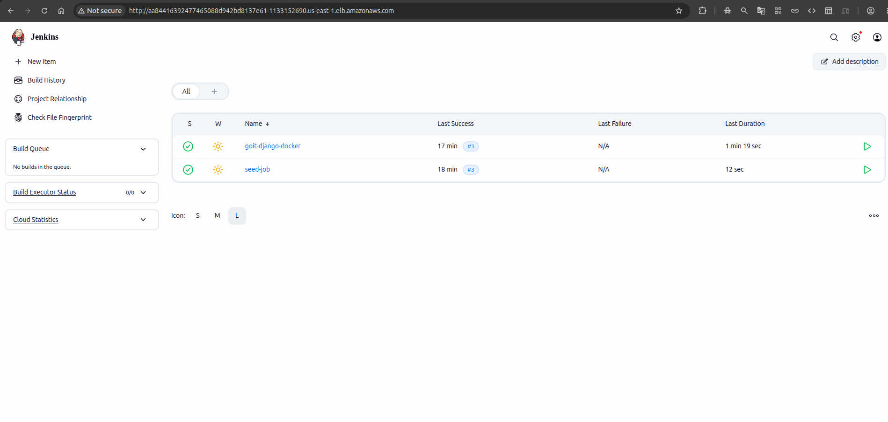
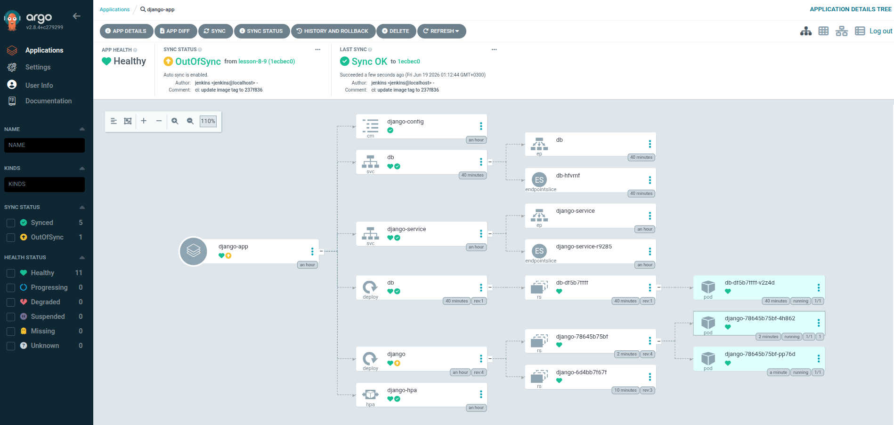
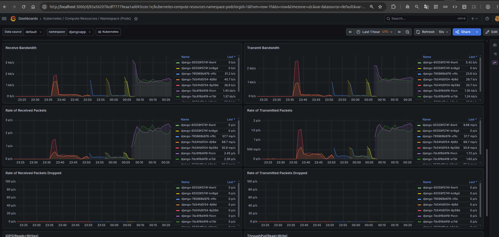

# Django Infrastructure and CI/CD Pipeline Architecture

## Project Overview

This project serves as a comprehensive DevOps environment, designed to deploy a containerized Django application using modern infrastructure practices. The primary objective is the hands-on application and mastery of AWS services, Infrastructure as Code (IaC), continuous integration and deployment (CI/CD) workflows, and cluster monitoring.

## Architecture and Environment Configuration

The environment is structured around a robust AWS cloud architecture, leveraging Kubernetes and GitOps methodologies. All infrastructure components are provisioned and managed using Terraform.

### Security

Security is established at both the network and resource access levels. The infrastructure includes a custom Virtual Private Cloud (VPC) configured with NAT gateways and specific routing policies to isolate resources appropriately. Access control and communication boundaries are enforced through AWS IAM (Identity and Access Management) and Security Groups. Furthermore, sensitive data and credentials within the Kubernetes cluster are managed securely using the External Secrets operator.

### Django Application Deployment and CI/CD

The core application stack consists of a Django framework, an RDS Standard PostgreSQL database. The application is containerized via Docker and its images are stored securely in AWS Elastic Container Registry (ECR).

The deployment lifecycle is fully automated using a comprehensive CI/CD pipeline:

- **Continuous Integration** is orchestrated by Jenkins, utilizing a declarative `Jenkinsfile` for building and testing.
- **Continuous Deployment** is implemented using Argo CD and Helm charts following GitOps principles. This ensures that the state of the AWS EKS (Elastic Kubernetes Service) cluster strictly matches the repository configurations.

### Monitoring and Autoscaling

System health and cluster metrics are continuously collected and visualized using the `kube-prometheus-stack`, which deploys Prometheus, Grafana, and `node-exporter`. To handle varying traffic loads effectively, application autoscaling is configured via a Horizontal Pod Autoscaler (HPA) defined within the application's Helm charts.

## Documentation Index

For detailed instructions, setup guides, and specific component configurations, please refer to the following documentation files:
<!-- [app/README.md](app/README.md) -->
- **Development Tools Setup**: [./DEVTOOLS.README.md](./DEVTOOLS.README.md)
- **Local Development Guide**: [./app/README.md](./app/README.md)
- **Infrastructure (Terraform) Configurations**: [./infra/terraform/README.md](./infra/terraform/README.md)
- **Monitoring Configuration Guide**: [./infra/terraform-monitoring/README.md](./infra/terraform-monitoring/README.md)

## System Visualizations

The following images illustrate the deployed components and active workflows within the current architecture:

_Description: Jenkins dashboard displaying the Continuous Integration pipeline stages and execution status for the project._

_Description: Argo CD interface detailing the GitOps schema deployment status, health, and synchronization of Kubernetes resources within the EKS cluster._

_Description: Grafana monitoring dashboards configured via the Prometheus stack, providing real-time metrics and operational data for the infrastructure._
